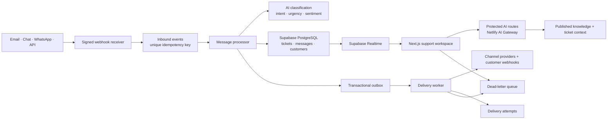
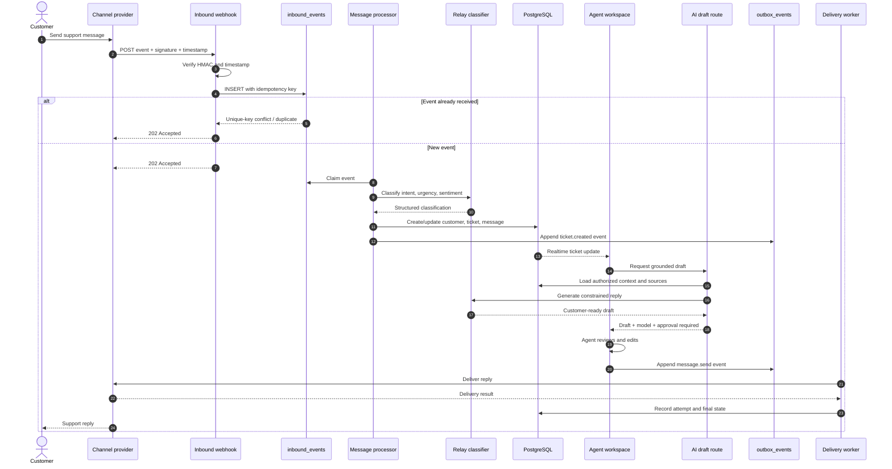
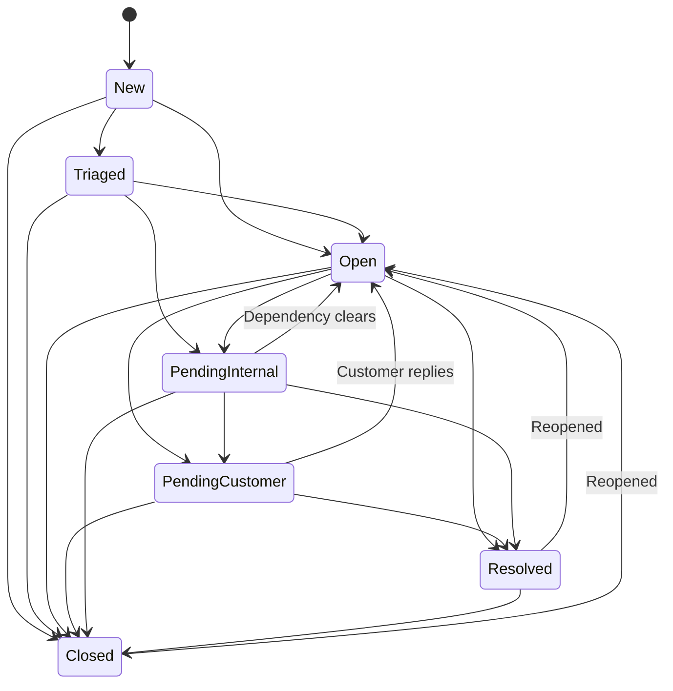

# Dynamis Relay

**An AI-native customer support platform for fast, reliable, human-controlled service.**

[Live demo](https://dynamis-relay.netlify.app) · [Support workspace](https://dynamis-relay.netlify.app/workspace/) · [Report an issue](https://github.com/eemirex/dynamis-relay/issues)


## Overview

Dynamis Relay is a portfolio-grade customer support operations platform designed around a hard requirement: **every customer message should reach a deliberate, observable outcome**.

Relay combines a shared inbox, customer context, AI-assisted drafting, a trusted knowledge base, SLA operations, queue management, reporting, automations, and delivery reliability in one workspace. Its AI copilot grounds drafts in approved sources and requires human review by default. Its event pipeline makes duplicate handling, retries, transitions, delivery attempts, and dead letters visible instead of hiding them behind a spinner.

The public deployment is a credential-free interactive demo. The repository also includes a production-shaped backend foundation with Supabase authentication, multi-tenant PostgreSQL and RLS, signed inbound webhooks, an idempotent message processor, a transactional outbox, explicit ticket transitions, and server-only AI routes.

> Every customer, company, ticket, statistic, and activity in the demo is fictional.

## Product capabilities

- **Shared inbox** with channels, priority, SLA risk, ownership, tags, and customer sentiment.
- **Conversation workspace** with customer messages, internal events, status transitions, assignments, and reply composition.
- **Relay Copilot** with conversation briefs, recommended actions, grounded sources, confidence, and customer context.
- **Human-reviewed AI drafts** that can be edited before sending and remain part of the audit history.
- **Operational queues** organized by ticket state, workload, urgency, and assignee.
- **Customer database** with account, plan, history, CSAT, and open-ticket context.
- **Knowledge base** with collections, article status, AI usage, helpfulness, and detected content gaps.
- **Analytics** for response time, resolution, SLA attainment, channel mix, AI acceptance, quality, and agent performance.
- **Automations** with visible triggers, conditions, actions, run counts, and enable/disable controls.
- **Reliability console** showing live delivery attempts, retries, policy settings, latency, and dead-letter replay.
- **Global search** across tickets, customers, companies, and subjects.

## Architecture diagram



### Architecture decisions

| Decision | Reason |
| --- | --- |
| Transactional inbox/outbox | Separates provider acknowledgement from processing and delivery while preserving an auditable handoff. |
| Unique organization-scoped idempotency keys | Prevents provider retries from creating duplicate tickets or messages. |
| Explicit state machine | Makes permitted lifecycle changes testable and prevents accidental state skipping. |
| Human approval around AI | Keeps agents accountable for customer-facing commitments and catches unsupported claims. |
| RLS in PostgreSQL | Enforces tenant isolation regardless of which application path queries the data. |
| Server-only model calls | Keeps provider credentials and sensitive context out of browser bundles. |
| Delivery-attempt records | Makes retries, latency, status codes, and terminal failures inspectable. |

## Sequence diagram

This sequence describes an inbound customer message that results in an AI-assisted human reply.



## Ticket state machine

Ticket lifecycle rules live in [`src/lib/reliability/state-machine.ts`](./src/lib/reliability/state-machine.ts). Both the interface and transition API use the same transition map.



### Transition guarantees

- Invalid changes return `409 Conflict` from the transition API.
- Every successful change returns its previous state, next state, actor, and timestamp.
- The database stores a separate immutable `ticket_transitions` history.
- Reopening is explicit; resolved and closed are not permanent dead ends.
- Optimistic `version` values support future compare-and-swap updates when two agents act simultaneously.

## Retry logic

Retry behavior is implemented in [`src/lib/reliability/retry.ts`](./src/lib/reliability/retry.ts) and surfaced in the Reliability view.

### Policy

```ts
{
  maxAttempts: 5,
  baseDelayMs: 1_000,
  maxDelayMs: 60_000,
  jitter: "full"
}
```

For attempt `n`, the uncapped delay is:

```text
baseDelay × 2^(n - 1)
```

The delay is capped at 60 seconds. With full jitter, the actual wait is a random value between zero and the capped exponential delay. Jitter prevents many failed jobs from retrying simultaneously after a provider outage.

### Retryable outcomes

- `408 Request Timeout`
- `409 Conflict` when the operation is safe to repeat
- `425 Too Early`
- `429 Too Many Requests`
- All `5xx` provider responses
- Network interruption and provider timeout errors classified as transient

Validation errors, authentication failures, permission failures, and most other `4xx` responses fail immediately.

### Delivery lifecycle

```mermaid
flowchart LR
    Pending --> Processing
    Processing --> Delivered
    Processing --> RetryableFailure["Retryable failure"]
    RetryableFailure --> Retrying
    Retrying --> Processing
    Processing --> PermanentFailure["Permanent failure"]
    PermanentFailure --> DeadLetter["Dead letter"]
    Retrying --> DeadLetter: Attempts exhausted
    DeadLetter --> Pending: Manual replay
    DeadLetter --> Dismissed: Reviewed
```

### Concurrency and idempotency

- Workers claim ready events with `FOR UPDATE SKIP LOCKED`, preventing two workers from processing the same job.
- `locked_at` and `locked_by` make ownership observable and support stale-lock recovery.
- `(organization_id, idempotency_key)` is unique for inbound events.
- `(event_id, attempt_number)` is unique for delivery attempts.
- Provider external IDs are unique inside their organization and inbox.
- Replay uses the same aggregate and payload; it does not create a second business event.
- Events move to `dead_letter_events` only after attempts are exhausted or a terminal response is identified.

## Data model

| Domain | Tables |
| --- | --- |
| Identity and access | `profiles`, `organizations`, `organization_members`, `teams`, `team_members` |
| Support | `inboxes`, `customers`, `tickets`, `messages`, `tags`, `ticket_tags`, `ticket_transitions` |
| Service levels | `sla_policies`, due timestamps and response timestamps on `tickets` |
| Knowledge and AI | `knowledge_collections`, `knowledge_articles`, `ai_generations` |
| Automation | `automation_rules`, `automation_runs` |
| Reliability | `inbound_events`, `outbox_events`, `delivery_attempts`, `dead_letter_events` |
| Governance | `audit_log` |

The initial migration is [`supabase/migrations/202608030001_initial_support_schema.sql`](./supabase/migrations/202608030001_initial_support_schema.sql).

## Security model

- Row-level security is enabled on every table in the exposed `public` schema.
- Tenant authorization checks indexed organization membership, not user-editable JWT metadata.
- Only owners and administrators manage membership and organization settings.
- Agents may update operational records only inside organizations they belong to.
- Anonymous Data API access is revoked explicitly.
- Internal authorization and worker functions live in a non-exposed `private` schema.
- The outbox claim function is executable only by the service role.
- Browser code receives only the publishable Supabase key.
- Authentication uses cookie-based SSR clients and verified JWT claims.
- Inbound webhooks require an HMAC-SHA256 signature and a timestamp no older than five minutes.
- Model calls run server-side and treat customer content as untrusted data, not instructions.
- AI drafts cannot send themselves; the API returns `requiresApproval: true`.

See [SECURITY.md](./SECURITY.md) for operational guidance.

## API surface

| Method | Route | Purpose |
| --- | --- | --- |
| `POST` | `/api/webhooks/inbound` | Validate and accept an inbound provider event |
| `POST` | `/api/ai/draft-reply` | Generate a source-grounded support reply |
| `POST` | `/api/v1/tickets/:id/transition` | Validate and record a ticket state change |
| `GET` | `/auth/callback` | Complete Supabase PKCE authentication |

Example transition request:

```bash
curl --request POST http://localhost:3000/api/v1/tickets/TICKET_ID/transition \
  --header "Content-Type: application/json" \
  --cookie "your-auth-session-cookie" \
  --data '{"from":"open","to":"pending_customer"}'
```

## AI design

Relay uses `gpt-5.4-mini` through Netlify AI Gateway for support drafting. The route supplies only the authorized conversation, agent instruction, and trusted sources. The system prompt prohibits invented product behavior, deadlines, refunds, and completed actions.

The `ai_generations` table is designed to record:

- Model and feature
- Grounding source IDs
- Confidence
- Token and latency metrics
- Whether an agent accepted the draft
- Whether the draft was edited before sending

This makes AI performance measurable by outcome instead of raw generation count.

## Testing strategy

### Current automated tests

The Vitest suite currently covers the reliability-critical pure logic:

1. Valid transition from `open` to `pending_customer`.
2. Explicit reopening from `closed` to `open`.
3. Rejection of an invalid `new` to `resolved` jump.
4. Exponential delay capping.
5. Deterministic full-jitter calculation.
6. Retry after a transient operation failure.
7. Retryable versus terminal HTTP status classification.
8. Duplicate inbound events stop before AI classification.
9. Successful processing persists the ticket and emits an outbox event.

Run the checks:

```bash
pnpm typecheck
pnpm lint
pnpm test
pnpm build
```

### Test pyramid

| Layer | Scope | Examples |
| --- | --- | --- |
| Unit | Pure state and reliability logic | Transitions, backoff, jitter, signatures, idempotency keys |
| Integration | Database and route boundaries | RLS isolation, outbox claiming, webhook validation, transition conflicts |
| Contract | Provider adapters | Email, WhatsApp, chat, and customer webhook payload compatibility |
| End-to-end | Agent and customer journeys | Receive → route → draft → approve → send → resolve |
| Resilience | Failure and concurrency behavior | Provider `429`, timeouts, duplicate delivery, worker crash, stale lock, replay |
| Security | Authorization and abuse cases | Cross-tenant access, forged signatures, prompt injection, rate limiting |

### High-value future test cases

- Two workers race to claim the same outbox job; exactly one wins.
- A provider sends the same message five times; one ticket/message is created.
- A worker crashes after provider delivery but before marking success; replay remains idempotent.
- RLS blocks tickets, messages, articles, and dead letters across organizations.
- Agent A updates version 4 while Agent B submits version 3; Agent B receives a conflict.
- A customer message includes prompt-injection text; the model follows the trusted system constraints.
- Permanent `401`/`403` provider errors bypass retries and go directly to review.
- A dead-letter replay records the actor and preserves the original payload snapshot.

## Run locally

### Requirements

- Node.js 22+
- pnpm 10.12+
- A Supabase project for connected mode
- A production Netlify deploy before using AI Gateway locally

```bash
git clone https://github.com/eemirex/dynamis-relay.git
cd dynamis-relay
pnpm install
cp .env.example .env.local
pnpm dev
```

Open [http://localhost:3000](http://localhost:3000). Demo mode is enabled by default and needs no external credentials.

### Environment variables

| Variable | Required | Purpose |
| --- | --- | --- |
| `NEXT_PUBLIC_SUPABASE_URL` | Connected mode | Supabase project URL |
| `NEXT_PUBLIC_SUPABASE_PUBLISHABLE_KEY` | Connected mode | Browser-safe publishable key |
| `NEXT_PUBLIC_DEMO_MODE` | No | Enables the credential-free portfolio experience |
| `NEXT_PUBLIC_APP_URL` | Recommended | Canonical application URL |
| `OPENAI_API_KEY` | Local AI only | Injected by Netlify AI Gateway in production |
| `OPENAI_BASE_URL` | No | OpenAI-compatible gateway endpoint |
| `INBOUND_WEBHOOK_SECRET` | Webhooks | Verifies inbound provider events |

Never commit service-role keys, provider credentials, customer payloads, or webhook secrets.

## Connect Supabase

1. Create and link a Supabase project.
2. Apply the migration with `supabase db push`.
3. Add the project URL and publishable key to `.env.local`.
4. Set `NEXT_PUBLIC_DEMO_MODE=false`.
5. Configure the application URL and `/auth/callback` redirect.
6. Run database advisors and test RLS with users from two separate organizations.

New Supabase projects may require explicit Data API exposure for public-schema tables. This migration includes explicit authenticated grants and RLS policies, but project-level Data API settings still control which schemas are exposed.

## Deployment

The public Netlify build creates a static export of the landing page and interactive workspace. Server-only routes are temporarily excluded during export and restored immediately afterward.

For a connected deployment, use Netlify’s standard Next.js runtime so route handlers become functions. Add Supabase variables, complete one production deploy to activate AI Gateway, and configure rate limiting for AI endpoints.

## Future improvements

### Product

- Gmail, Outlook, WhatsApp Business, Slack, and in-app chat adapters
- Customer-facing help center with localization and authenticated articles
- Skills-based routing, capacity planning, and agent schedules
- Collision detection and presence when multiple agents view a ticket
- CSAT collection and churn-risk feedback into the customer record
- Voice transcription and call summarization
- Draft approval policies by queue, customer plan, risk, or confidence

### AI and knowledge

- Hybrid full-text/vector retrieval with per-source permissions
- Automated knowledge freshness checks and stale-answer warnings
- Offline evaluation datasets for groundedness, empathy, and policy compliance
- Confidence calibration against actual agent acceptance and resolution outcomes
- PII detection and redaction before model calls
- Multilingual intent classification, drafting, and article retrieval
- Model fallback and circuit breaking across supported providers

### Reliability and scale

- Dedicated queue infrastructure for sustained high-volume workloads
- Heartbeats and automatic recovery for stale outbox locks
- Provider-specific retry budgets and rate-limit headers
- Circuit breakers, bulkheads, and adaptive concurrency per destination
- Partitioning for messages, audit logs, attempts, and inbound events
- Retention policies for raw provider payloads and audit history
- Private Supabase Realtime Broadcast channels instead of basic Postgres Changes
- OpenTelemetry traces connecting webhook receipt, AI calls, database writes, and delivery attempts
- Automated dead-letter alerts and replay runbooks

### Engineering

- Playwright end-to-end journeys and accessibility scans
- Ephemeral Supabase branches in CI for migration and RLS testing
- Consumer-driven contracts for every channel provider
- Load tests for queue claiming, inbox pagination, and Realtime fan-out
- Feature flags and progressive delivery for automation and AI changes
- Generated OpenAPI documentation and typed API client

## Repository quality

- Strict TypeScript
- Pinned dependencies and committed lockfile
- ESLint with zero-warning CI
- Vitest reliability suite
- GitHub Actions for typecheck, lint, tests, and production build
- MIT license, contribution guide, and security policy
- No generated-platform metadata or template attribution

## License

Released under the [MIT License](./LICENSE).

---

Built by [Emmanuel Emirex](https://github.com/eemirex) as part of the Dynamis product portfolio.
